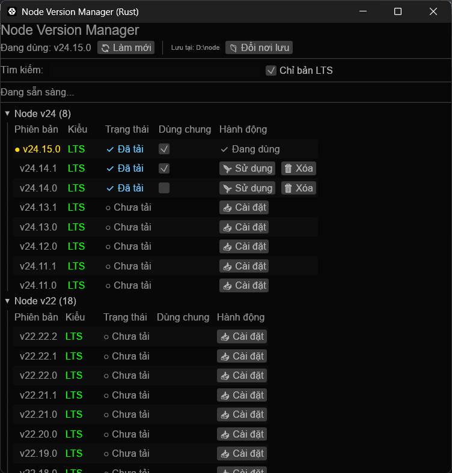
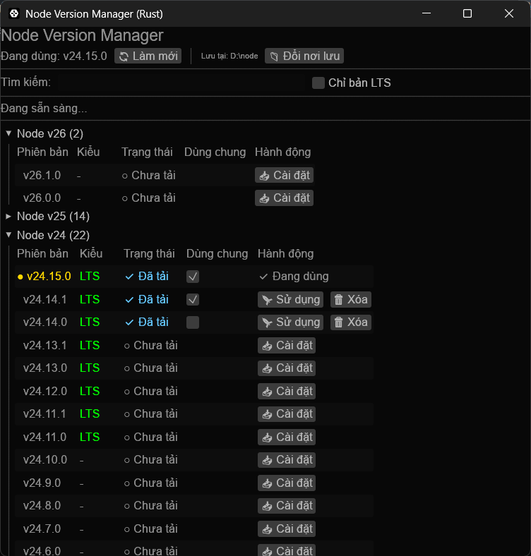

# 🚀 Node Version Manager (Rust Edition)

Một công cụ quản lý phiên bản Node.js (NVM) siêu nhanh, hiện đại và hỗ trợ đa nền tảng (Windows & Linux), được viết bằng Rust với giao diện đồ họa (GUI) trực quan.



*Giao diện hiện đại và trực quan của NVM Rust*



*Hỗ trợ đa nền tảng Windows & Linux*

## ✨ Tính năng nổi bật

- **Quản lý đa nền tảng:** Hỗ trợ đầy đủ cho cả Windows và Linux.
- **Giao diện trực quan:** Tải, cài đặt và chuyển đổi các phiên bản Node.js chỉ với một cú click chuột.
- **Hỗ trợ LTS:** Dễ dàng lọc các phiên bản Long Term Support (LTS) ổn định.
- **Quản lý Global Modules thông minh:** 
    - Tùy chọn dùng chung (Shared) thư mục npm modules giữa các phiên bản.
    - Tự động cập nhật biến môi trường PATH và `.npmrc`.
- **An toàn & Tin cậy:** Tự động dọn dẹp các đường dẫn cũ, tránh làm hỏng cấu hình hệ thống.
- **Di chuyển dữ liệu:** Cho phép đổi thư mục lưu trữ (Storage) và tự động di chuyển toàn bộ các phiên bản đã tải sang nơi mới.

## 🛠️ Cài đặt & Sử dụng

### 1. Tải về bản build sẵn
Bạn có thể vào mục [Releases](../../releases) để tải về file thực thi tương ứng với hệ điều hành của mình:
- **Windows:** Tải file `.exe`.
- **Linux:** Tải file binary và cấp quyền thực thi (`chmod +x`).

### 2. Tự build từ nguồn (Source)
Nếu bạn đã cài đặt Rust, bạn có thể tự biên dịch:

```bash
# Clone dự án
git clone https://github.com/your-username/node-version-manager.git
cd node-version-manager

# Build cho hệ điều hành hiện tại
cargo build --release
```

### 3. Biên dịch chéo (Cross-compile)
Sử dụng `cargo-zigbuild` để tạo bản build cho cả hai nền tảng:

```bash
# Thêm target
rustup target add x86_64-pc-windows-gnu
rustup target add x86_64-unknown-linux-gnu

# Build cho Windows
cargo zigbuild --target x86_64-pc-windows-gnu --release

# Build cho Linux
cargo zigbuild --target x86_64-unknown-linux-gnu --release
```

## 🎨 Công nghệ sử dụng

- **Ngôn ngữ:** [Rust](https://www.rust-lang.org/) (Hiệu năng và an toàn bộ nhớ).
- **GUI Framework:** [egui/eframe](https://github.com/emilk/egui) (Giao diện tối hiện đại, phản hồi nhanh).
- **HTTP Client:** [reqwest](https://github.com/seanmonstar/reqwest) (Tải Node.js nhanh chóng).
- **Hệ thống nén:** `zip-rs`, `tar`, `flate2`.

## 🛡️ Lưu ý trên Linux
Công cụ sử dụng kiến trúc **Symlink Farm** tại thư mục `~/.local/bin`. Mọi binary (`node`, `npm`, `npx`...) đều được tự động tạo symlink vào đây, giúp giữ cho các file cấu hình hệ thống (`.bashrc`, `.profile`) luôn sạch sẽ.
Bạn có thể **sử dụng Node ngay lập tức** trên mọi terminal sau khi chuyển đổi phiên bản mà không cần phải chạy lại lệnh `source` hay khởi động lại shell. Chỉ cần đảm bảo `~/.local/bin` có sẵn trong biến môi trường `$PATH` của bạn (hầu hết các bản phân phối Linux đều đã có sẵn).

---
*Phát triển với ❤️ bởi uongsuadaubung*
